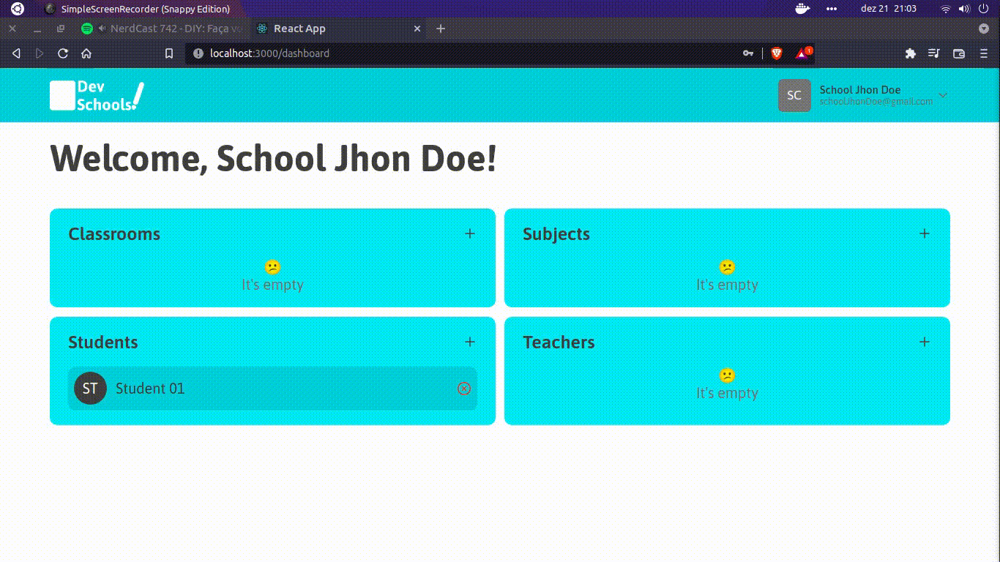
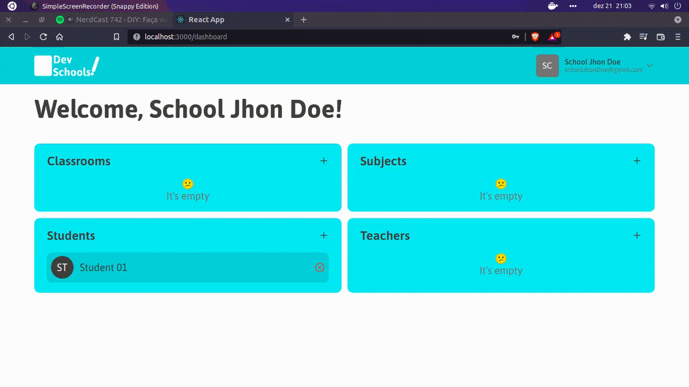
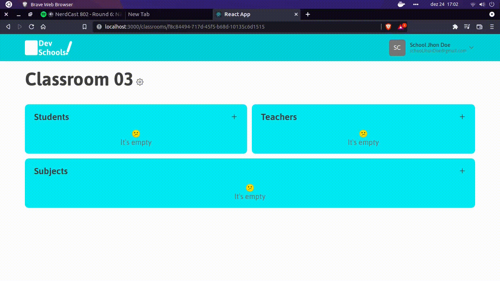

# Features

<!--ts-->
- [Register user of different types](#Register-user-of-different-types)
- [Add/delete classroom](#Adddelete-classroom)
- [Add/delete subject](#Adddelete-subject)
- [Edit classroom](#Edit-classroom)
- [Insert/remove teacher, students and subjects in a classroom](#Insertremove-teacher-students-and-subjects-in-a-classroom)
<!--ts-->

## Register user of different types
- The schools sign up in DevSchools
- The students and teachers are registered in a school
    - An email is sent to the student/teacher to setup the account

## Add/delete classroom

## Add/delete subject

## Edit classroom

## Insert/remove teacher, students and subjects in a classroom

