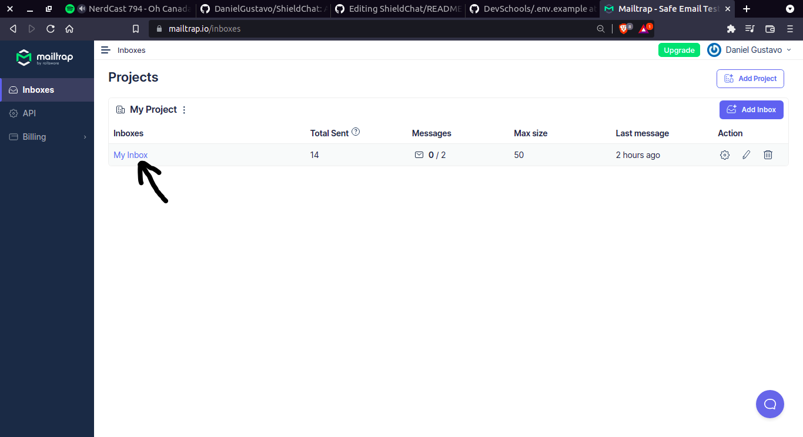

# Setup Mailtrap

1. Sign-up in [Mailtrap](https://mailtrap.io/register/signup?ref=header)

2. Access an inbox

3. Choice nodemailer integration

4. Copy value "user" to "MAILER_USER", and "pass" to "MAILER_PASSWORD" in file `.env` in backend folder
